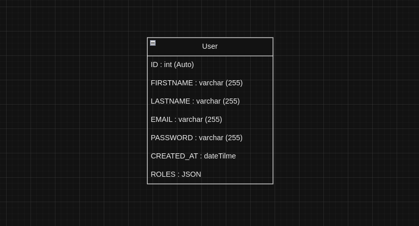

# Gestion de projet : création de compte

## Besoin

L'application contient un formulaire d'inscription, qui est aussi la page d'accueil. Pour s'inscrire, le **visiteur** aura besoin de renseigner :
- son email (unique)
- son prénom
- son nom
- un mot de passe sécurisé (à répéter)

Quand il est inscrit, il devient un **utilisateur** et doit âtre redirigé vers la page de son profil, qui lui permettra de le modifier.

Pour un **administrateur**, il devra avoir la possibilité d'accéder à l'historique des inscriptions des utilisateurs. 

## Modélisation de la base de données

## Définitions

- Visiteur : Une personne physique non connectée au site.
- Utilisateur : Une personne physique connectée au site.
- Administrateur : Une personne physique connectée au site avec des droits supérieurs par rapport aux utilisateurs.
- Historique des inscriptions : Contient la liste des utilisateurs qui sont inscrits avec leur nom, prénom, email et date d'inscription.

Camille GENTILI
Matthieu GARCIA
Nathan PICOT (l'homme mystère)
Tristan JACQUEMARD

[Trello](https://trello.com/b/FXTetAkJ/application-cr%C3%A9ation-de-compte)
